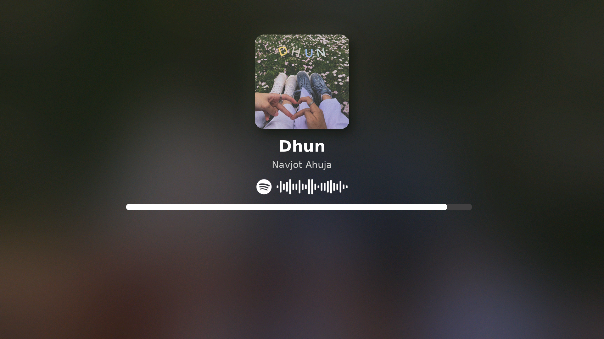

# NowFrame

A premium, full-screen Spotify now-playing display for Raspberry Pi and direct Linux framebuffer output.

NowFrame turns a Raspberry Pi and HDMI display into a dedicated music display with album artwork, adaptive backgrounds, smooth transitions, live progress, idle clock modes, and scannable Spotify Codes.



## Features

- Premium and Classic renderer modes
- Current track title, artist, and album artwork
- Adaptive blurred backgrounds generated from album colors
- Configurable album glow and rounded artwork
- Smooth song and mode crossfades
- Locally interpolated progress updates
- Transparent, contrast-aware Spotify Codes
- Validated Spotify Code caching
- Idle clock and automatic black-screen modes
- Recovery from temporary Spotify or network failures
- Direct RGB565 framebuffer output
- Automatic startup through systemd
- Centralized configuration in `config.py`

## Tested platform

NowFrame is currently tested on:

- Raspberry Pi Zero 2 W
- DietPi / Debian 13 (Trixie), 64-bit
- Python 3.13
- 1920 × 1080 HDMI display
- 16-bit RGB565 framebuffer at `/dev/fb0`

Other Raspberry Pi models and framebuffer resolutions may work but have not yet been fully tested.

## Requirements

- Raspberry Pi with a Linux framebuffer
- Attached display
- Internet access
- Spotify account
- Spotify developer application
- Root access for installation and systemd setup

NowFrame displays playback occurring on another Spotify device. It is not a Spotify audio player.

## Installation

Clone NowFrame:

```bash
sudo apt update
sudo apt install -y git

sudo git clone \
    https://github.com/th3-hollow/nowframe.git \
    /opt/nowframe
```

Run the installer:

```bash
sudo /opt/nowframe/scripts/install.sh
```

The installer creates a dedicated service account, virtual environment, environment file, and systemd service.

## Spotify setup

Create an application in the [Spotify Developer Dashboard](https://developer.spotify.com/dashboard).

Add this exact redirect URI:

```text
http://127.0.0.1:8888/callback
```

Use `127.0.0.1`, not `localhost`.

Edit the private environment file:

```bash
sudo nano /etc/nowframe.env
```

Set:

```text
SPOTIPY_CLIENT_ID=your_spotify_client_id
SPOTIPY_CLIENT_SECRET=your_spotify_client_secret
SPOTIPY_REDIRECT_URI=http://127.0.0.1:8888/callback
```

Authorize Spotify:

```bash
sudo runuser -u nowframe -- sh -c '
    set -a
    . /etc/nowframe.env
    set +a
    cd /opt/nowframe
    HOME=/var/lib/nowframe \
        .venv/bin/python \
        scripts/authorize_spotify.py
'
```

Open the displayed Spotify authorization URL and approve access.

If the browser cannot open the final `127.0.0.1` page, copy the complete URL from its address bar and paste it into the terminal prompt.

## Start NowFrame

```bash
sudo systemctl enable --now nowframe.service
```

Check its status:

```bash
sudo systemctl status nowframe.service --no-pager
```

View recent logs:

```bash
sudo journalctl -u nowframe.service -n 50 --no-pager
```

## Configuration

Edit:

```bash
sudo nano /opt/nowframe/config.py
```

Restart after changing settings:

```bash
sudo systemctl restart nowframe.service
```

Important options include:

```python
RENDERER_MODE = "premium"
SPOTIFY_CODE_ENABLED = True
GLOW_ENABLED = True
IDLE_DISPLAY_MODE = "clock_album"
IDLE_BLACK_TIMEOUT = 600
CROSSFADE_ENABLED = True
PERFORMANCE_LOGGING = True
```

## Updating

```bash
sudo systemctl stop nowframe.service

sudo -u nowframe \
    git -C /opt/nowframe \
    pull --ff-only

sudo /opt/nowframe/scripts/install.sh

sudo systemctl start nowframe.service
```

## Troubleshooting

Useful first checks:

```bash
sudo systemctl status nowframe.service --no-pager
sudo journalctl -u nowframe.service -n 100 --no-pager
ls -l /dev/fb0
cat /sys/class/graphics/fb0/virtual_size
cat /sys/class/graphics/fb0/bits_per_pixel
```

## Security

Never commit or share:

- Spotify Client IDs and Client Secrets
- Spotify OAuth cache files
- `/etc/nowframe.env`
- Full SD-card images containing an authenticated installation

The repository includes only `nowframe.env.example`, which contains placeholder values.

## Project status

NowFrame works reliably on the tested Pi Zero 2 W installation. The public installer should be considered early-release software until it has been tested on additional clean systems and displays.

## Disclaimer

NowFrame is an independent open-source project and is not affiliated with, endorsed by, or sponsored by Spotify.

Spotify, Spotify Codes, and related marks belong to Spotify AB. Spotify Code images are retrieved from Spotify’s hosted scannables service and require network access when not already cached.

## License

NowFrame is available under the [MIT License](LICENSE).

Copyright (c) 2026 [th3-hollow](https://github.com/th3-hollow).
